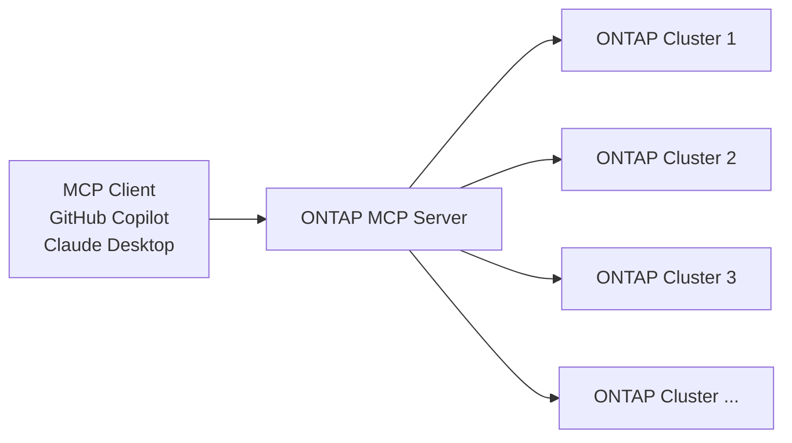

# ONTAP Model Context Protocol Server

The ONTAP Model Context Protocol (MCP) server provides MCP clients like GitHub Copilot, Claude Desktop, and other large language models (LLMs) access to your NetApp ONTAP storage systems: create automation tools enabling self-service provisioning and lifecycle management. 

Supports multi-cluster management, volume lifecycle operations, data protection policies, and NFS/CIFS access control.  

:star2: Use Cases

- **AI-Assisted Storage Management**: Direct integration with AI assistants via MCP
- **Self-Service Provisioning**: Allow users to provision and manage storage resources through natural language commands.
- **Data Protection**: Automated snapshot policy management
- **Multi-Cluster Management**: Manage multiple ONTAP clusters through a single MCP interface. 
- **Custom Workflows**: Create custom workflows and automations tailored to your specific storage environment.

## What is MCP?

The [Model Context Protocol](https://modelcontextprotocol.io/docs/getting-started/intro) (MCP) is an open standard that enables interactions between MCP clients and external data sources.
The ONTAP MCP server provides APIs for large language models (LLMs) to query and provision ONTAP cluster objects. This allows you to leverage AI assistants like GitHub Copilot and Claude Desktop to manage your ONTAP storage systems through natural language commands.

## What You Can Ask

The ONTAP MCP server allows you to ask natural language questions about your ONTAP clusters and:

- provision and manage storage volumes
- configure NFS and CIFS export policies
- manage snapshot policies and data protection
- configure QoS policies
- and much more! 

**Create a Volume**

- "On the sar cluster, create a 100MB volume named docs on the marketing svm and the umeng_aff300_aggr2 aggregate with thin provisioning enabled."

**Resize a Volume**

- "On the sar cluster, resize the docs volume on the marketing svm to 500MB."
- "On the sar cluster, increase the size of the docs volume on the marketing svm by 200MB."

**Enable Autogrowth on a Volume**

- "On the sar cluster, enable autogrowth on the docs volume"

**Manage QoS Policies**

- "On the sar cluster, create a fixed QoS policy named gold on the marketing svm with a max throughput of 5000 iops/s"
- "On the sar cluster, set the qos policy of the docs volume on the marketing svm to 'gold'"

**Manage Snapshot Policies**

- "On the sar cluster, create a snapshot policy named every4hours on the gold SVM. The schedule is 4 hours and keep the last 5 snapshots."

## Architecture

The ONTAP MCP server uses a multi-cluster architecture with centralized credential management and unified tool interfaces. All tools operate through registered cluster configurations rather than requiring credentials for each API call, providing enhanced security and simplified multi-cluster workflows.

## Prerequisites

- NetApp ONTAP cluster(s) with admin credentials
- Docker environment for running the MCP server
- Network connectivity from MCP server to your ONTAP cluster(s)

## Next Steps

- [Install the MCP Server](install.md)
- [Configure Environment Variables](install.md#configuration)
- Try the [Usage Examples](examples.md)